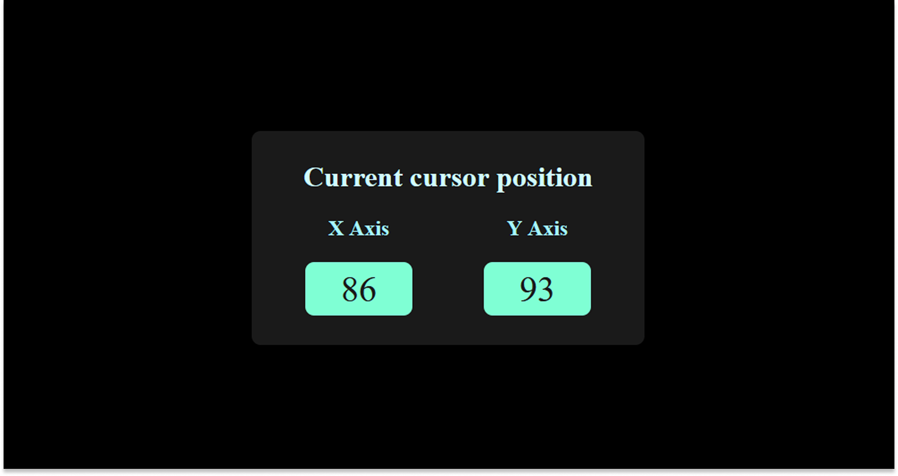

# 🖱️ Cursor Coordinate Tracker
A simple project that displays the current position of the mouse cursor (X, Y coordinates) in real-time.

## 🚀 Features
- Displays live mouse cursor coordinates on the screen
- Lightweight and easy to use
- Beginner-friendly project
  
## 🛠️ Technologies Used

- **HTML**
- **CSS**
- **JavaScript**

## ⚡ How to Run
1. Clone this repository
```bash
git clone https://github.com/Rohan-Korake/Cursor-Tracker.git
```

# 📸 Demo


# 📞 Contact
For suggestions or contributions, feel free to contact :
- 📧 Email : rohannkorake@gmail.com
- 📂 GitHub : https://github.com/Rohan-Korake
- 🔗 Linkedin : https://www.linkedin.com/in/rohan-korake-720848342

